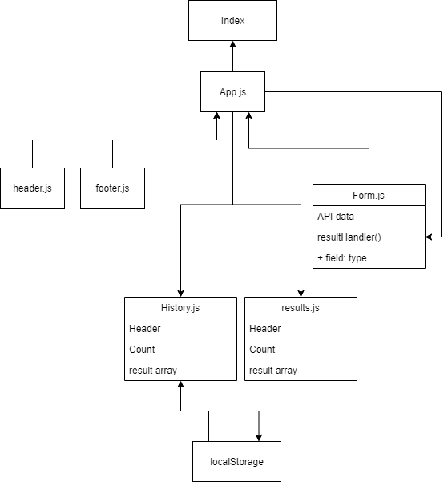

# LAB - Class 28

## Project: RESTy

### Author: Dina Alsaid

### Links and Resources

[deployment on github](https://dinaAlsaid.github.io/RESTy/)
[deploymment on Netlify]()

### Setup

#### `.env` requirements

- `PORT` - 3000

#### How to initialize/run your application

- `npm start`
- `npm test`

#### How to use your library

#### Tests

Test data is being fetched when form is submitted

#### UML

#### Notes

Did not finish the lab, did initial code, did not deploy.
