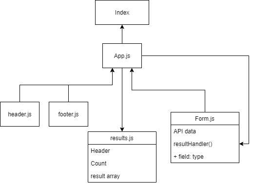

# LAB - Class 27

## Project: RESTy

### Author: Dina Alsaid

### Links and Resources

<!-- - [ci/cd](http://xyz.com) (GitHub Actions)
- [back-end server url](http://xyz.com) (when applicable)
- [front-end application](http://xyz.com) (when applicable) -->

### Setup

#### `.env` requirements

i.e.

- `PORT` - 3000

#### How to initialize/run your application

- `npm start`
- `npm test`

#### How to use your library

#### Tests

Test data is being fetched when form is submitted

#### UML

